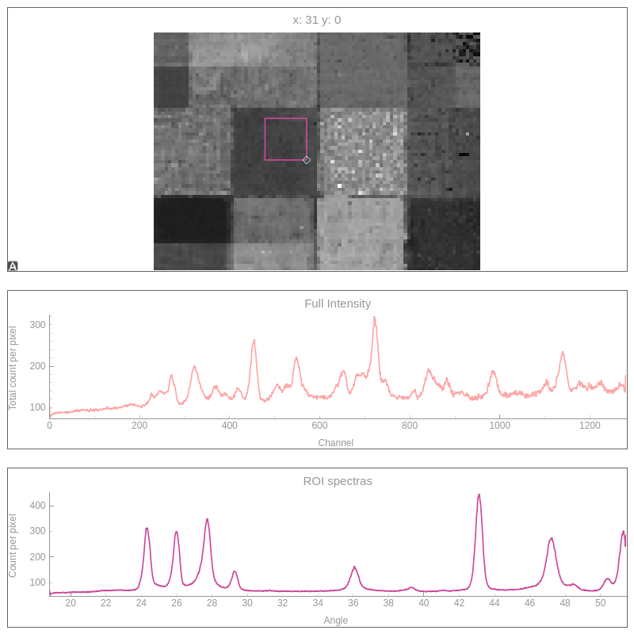

# pyMaXRDXRF

usage:

```
python main.py data_XRD
```

where data_XRD is a folder with the source data.

after first use you can load '.h5' file with  `-l` option 

```
python main.py data_XRD -l
```

Scanning parameters `'Scanning_parameters.txt'` and calibration file `'calibration.ini'` are by default located in the data folder.


